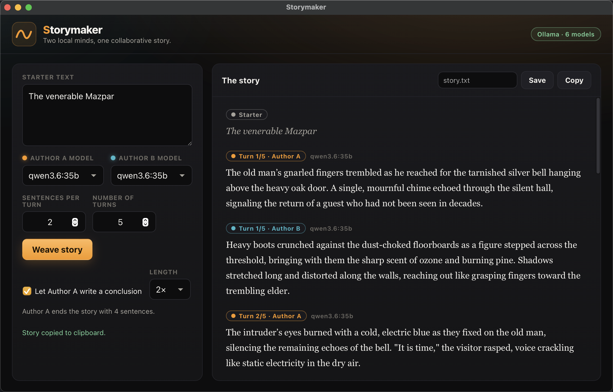
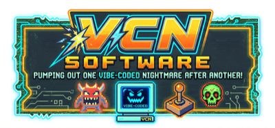

# Storymaker

> Two local minds, one collaborative story.

Storymaker is a [GitHub Copilot CLI](https://github.com/github/copilot-cli) extension that opens a native desktop window where **two local [Ollama](https://ollama.com) models take turns writing a story**. You provide the opening line, pick a model for each author, and watch the prose stream in live as the two models hand the narrative back and forth.



## Features

- 🤝 **Two-author collaboration** — Author A writes a configurable number of sentences, Author B continues, and they alternate for as many turns as you choose.
- 🏁 **Optional conclusion** — on by default, the opening author (Author A) wraps up the story with a closing passage of configurable length (1×–4× the per-turn sentence count, default 2×).
- 🧠 **Full shared context** — every turn, each author receives the *entire* story so far, so the narrative stays coherent as it grows.
- 🎛️ **Pick any installed model per author** — both dropdowns are populated from your local Ollama models; mix and match (e.g. `llama3.2` + `qwen2.5`).
- ⚡ **Live token streaming** — text appears word-by-word with a blinking caret, color-coded by author.
- ⏹️ **Stop anytime** — cancel mid-generation and keep the partial story.
- 📋 **Copy & save** — copy the finished story to the clipboard, or save it to a file that begins with a YAML front matter block recording the models and settings used.
- ⌨️ **Editing shortcuts** — select-all, copy, cut, paste, and undo work in the text fields.
- 🎨 **Audible-inspired dark theme** — near-black canvas, signature orange accents, serif story type.

## How it works

```
┌──────────────────────────┐        ┌──────────────────────────┐
│  Webview (the UI)        │  RPC   │  Extension (main.mjs)     │
│  pick models, see story  │ ◄────► │  orchestrates the loop    │
└──────────────────────────┘        └────────────┬─────────────┘
                                                  │ HTTP
                                                  ▼
                                       ┌──────────────────────┐
                                       │  Ollama (localhost)  │
                                       │  /api/tags /api/chat │
                                       └──────────────────────┘
```

The extension (Node) owns all model orchestration. For each turn it sends the **full story so far** to the chosen model via Ollama's streaming `/api/chat`, appends the result, and pushes live tokens to the page. The page never talks to Ollama directly — it calls back into the extension through the webview bridge (`window.copilot.*`) and receives updates via `window.sm.*`.

Reasoning is disabled (`think: false`) so the models write prose directly instead of spending their token budget thinking — with an automatic fallback for models that don't support that flag.

## Requirements

- [GitHub Copilot CLI](https://github.com/github/copilot-cli)
- [Ollama](https://ollama.com) running locally (default `http://localhost:11434`)
- At least one pulled model — any model shown by `ollama list` works, for example:
  ```bash
  ollama pull llama3.2
  ollama pull qwen2.5
  ```

> **Privacy:** By default Storymaker talks to a local Ollama instance, so your
> starter text and the generated story stay on your machine. If you point
> `OLLAMA_HOST` at a remote or LAN server, that text is sent there instead.

## Installation

Storymaker is a **project-scoped Copilot CLI extension**. Clone this repo and open Copilot CLI from inside it:

```bash
git clone https://github.com/mmacy/storymaker.git
cd storymaker
copilot
```

The extension lives in `.github/extensions/storymaker/` and is auto-discovered. On first load Copilot installs its npm dependencies automatically. If the extension doesn't appear, run `/reload` (or restart the CLI).

## Usage

From within Copilot CLI:

```
/storymaker
```

This opens the Storymaker window. Then:

1. **Enter starter text** — the opening of your story.
2. **Choose a model** for Author A and Author B.
3. Set **sentences per turn** (1–10) and **number of turns** (1–25).
4. Optionally let **Author A write a conclusion** (on by default) and pick its length (1×–4× the per-turn sentence count).
5. Click **Weave story** and watch the two authors collaborate.
6. **Copy** or **Save** the finished story (saved files land in the repo root by default).

> The agent can also open and drive the window via the `storymaker_show`, `storymaker_eval`, and `storymaker_close` tools.

## Configuration

| Setting | Where | Default |
| --- | --- | --- |
| Ollama endpoint | `OLLAMA_HOST` env var | `http://localhost:11434` |
| Sentences per turn | UI | 2 (range 1–10) |
| Number of turns | UI | 3 (range 1–25) |
| Conclusion | UI | On |
| Conclusion length | UI | 2× sentences-per-turn (range 1×–4×) |
| Window size | `main.mjs` (`width`/`height`) | 1588 × 1280 (physical px) |

## Saved file format

Saved stories begin with a YAML front matter block capturing how the story was generated, followed by a blank line and the story text:

```yaml
---
title: "The venerable Mazpar awoke."
generator: Storymaker
created: "2026-06-04T21:12:11.611Z"
author_a_model: "qwen3.6:35b"
author_b_model: "gemma4:latest"
sentences_per_turn: 2
turns: 5
conclusion: true
conclusion_length: "2x"
conclusion_sentences: 4
ollama_host: "http://localhost:11434"
---
```

Copying to the clipboard yields the plain story without front matter.

## Project structure

```
.github/extensions/storymaker/
├── extension.mjs        # bootstrapper (installs deps, imports main.mjs)
├── main.mjs             # Ollama client + generation loop + callbacks
├── package.json
├── lib/                 # reusable webview library (do not edit)
│   ├── copilot-webview.js
│   └── webview-child.mjs
└── content/             # the UI served to the window
    ├── index.html
    ├── style.css
    └── main.js
```

See [AGENTS.md](AGENTS.md) for contributor and AI-agent guidance.

## License

Released under [Creative Commons CC0 1.0 Universal](LICENSE) — a public-domain
dedication. You can copy, modify, and distribute this work, even for commercial
purposes, without asking permission.

---

<p align="center">
  
</p>
